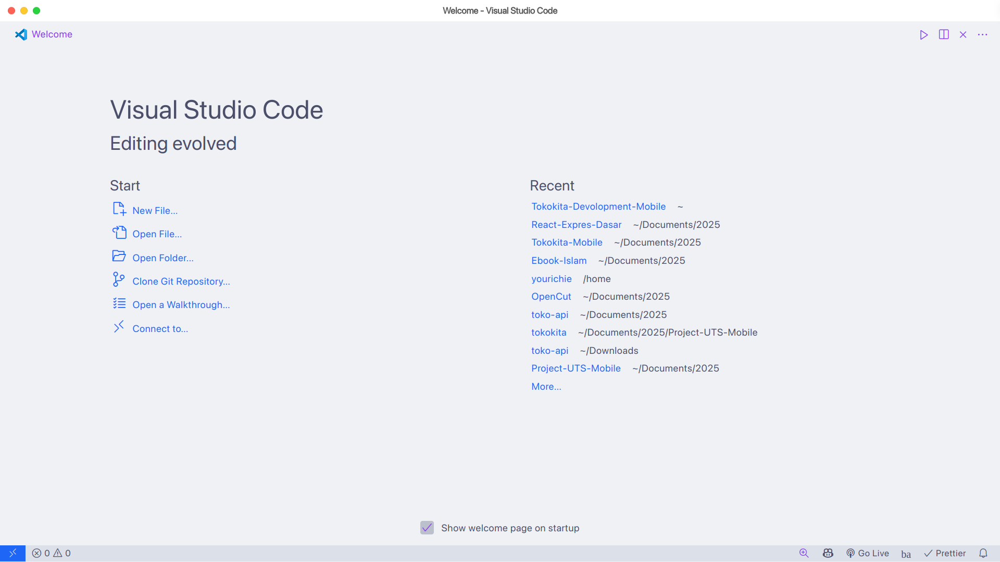
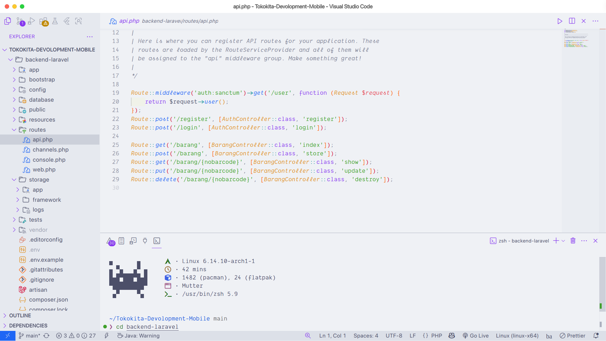

# 📁 VSCode Setup & Dokumentasi

Repositori ini berisi konfigurasi Visual Studio Code serta dokumentasi berupa gambar untuk menunjang pengembangan proyek.

---

## 📸 Dokumentasi Gambar

### Menu Utama



### Halaman Proyek



## 📂 Struktur Folder

```
.
├── public/
│   ├── menu-utama.png       # Gambar antarmuka menu utama aplikasi
│   └── project.png          # Gambar tampilan proyek secara umum
├── .vscode/
│   ├── extensions.json      # Daftar ekstensi VSCode yang direkomendasikan
│   ├── settings.json        # Pengaturan personalisasi untuk workspace
│   └── extensions.md        # Penjelasan tertulis ekstensi yang digunakan
└── README.md
```

---

## 🧩 Ekstensi VSCode

Ekstensi yang digunakan disimpan di:

- `.vscode/extensions.json` → untuk disarankan ke user lain saat membuka project ini
- `.vscode/extensions.md` → dokumentasi manual ekstensi (deskripsi & fungsinya)

Contoh ekstensi:

- ESLint
- Prettier
- Tailwind CSS IntelliSense
- React Snippets

---

## ⚙️ Settings VSCode

Pengaturan yang disimpan di `.vscode/settings.json` mencakup:

- Format on Save
- Font ligatures
- Font family (misal: `Dank Mono`)
- Assosiasi file berdasarkan ekstensi

---
